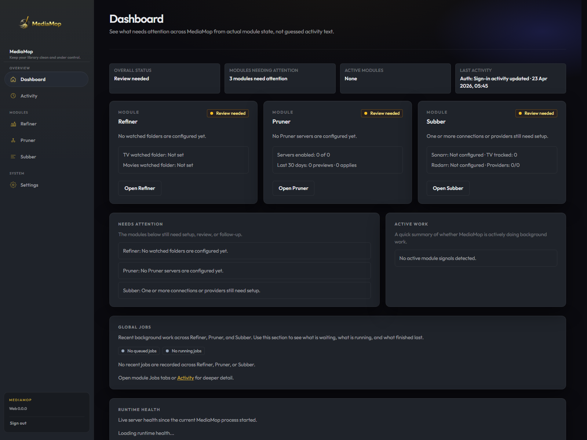
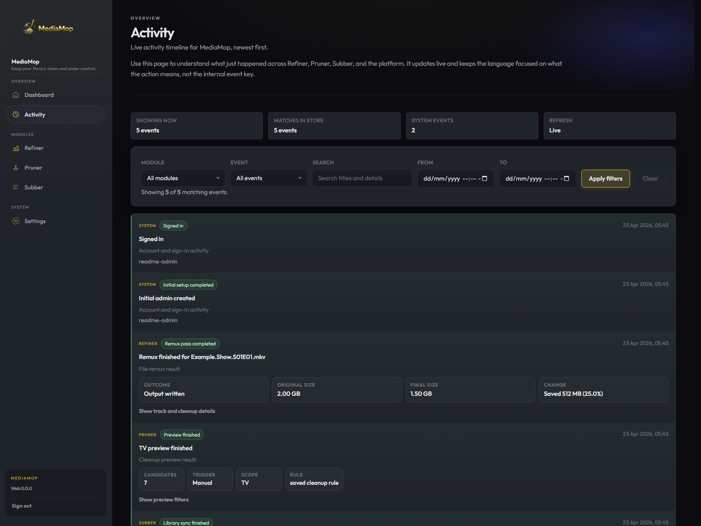
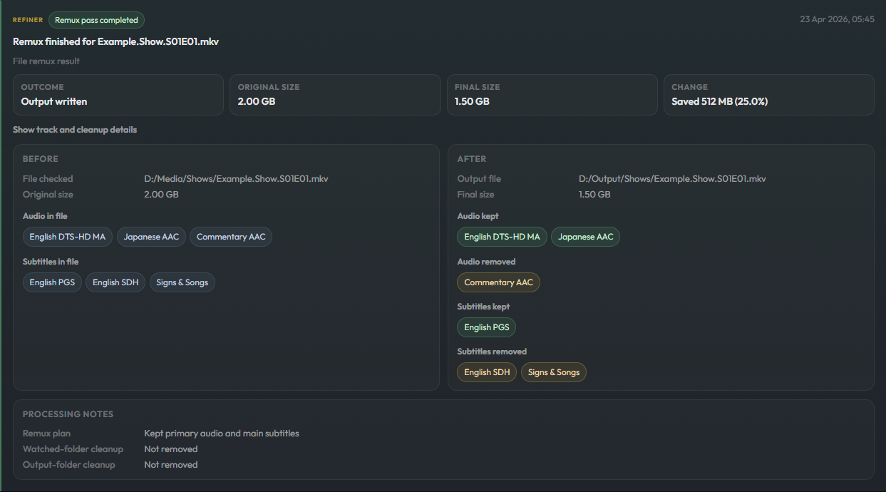

# MediaMop

<!-- README_LOCKED_SECTION_START: project-note -->
## A note on this project

MediaMop is a vibe-coded project.

I built it because I wanted a media workflow that matched the way I actually manage my library, and I could not find an existing tool that fit. I am not a software engineer and can't code and I have the upmost respect for the people that can.  So this started from a very practical place: solve the problems I kept running into and keep refining it until it worked the way I needed.

It is opinionated on purpose. Every module exists because it solved a real problem in my own setup first.

If it happens to fit the way you manage your library too, use it, improve it, and share those improvements under the same open license.

<!-- README_LOCKED_SECTION_END: project-note -->

## What MediaMop is

MediaMop is a self-hosted media operations app for people who want more control over how their library is processed and maintained.

It brings a few focused tools together in one place:

- **Refiner** cleans up media files by remuxing them into a cleaner, more consistent result.
- **Pruner** finds media that matches your cleanup rules so you can preview or remove it safely.
- **Subber** syncs your library from Sonarr and Radarr, tracks subtitle state, and manages subtitle providers and schedules.
- **Dashboard, Activity, and Settings** give you a live view of system health, recent work, logs, and core app configuration.

The app ships as a FastAPI + SQLite backend with a React + Vite web UI.

## Screenshots







## Quick start

Prerequisites:

- Python 3.11+
- Node.js LTS with `npm` on `PATH`

From the repository root:

1. Create the backend virtual environment:

   ```powershell
   cd apps\backend
   py -3 -m venv .venv
   .\.venv\Scripts\Activate.ps1
   pip install -e .
   ```

2. Copy `apps/backend/.env.example` to `apps/backend/.env` and set `MEDIAMOP_SESSION_SECRET`.
3. Run migrations:

   ```powershell
   cd ..\..
   .\scripts\dev-migrate.ps1
   ```

4. Start the repo-local dev stack:

   ```powershell
   cd apps\web
   npm ci
   npm run dev
   ```

The default dev URL is `http://localhost:8782/`.

## Runtime notes

- SQLite runtime files live under `MEDIAMOP_HOME`
- production deployments should expose one canonical HTTPS origin
- local development uses the Vite `/api` proxy; keep `VITE_API_BASE_URL` unset unless you know you need it

## License

MediaMop is licensed under the GNU Affero General Public License v3.0 or later (`AGPL-3.0-or-later`).

You can use, study, modify, and redistribute it under the license terms. If you distribute a modified version or run a modified version as a network service, the AGPL requires you to make the corresponding source code available under the same license.

## Verification

Optional local verification:

```powershell
.\scripts\verify-local.ps1
```

Canonical ports: [`docs/ports.md`](docs/ports.md)

Full local development instructions: [`docs/local-development.md`](docs/local-development.md)

## Releases

Release instructions and artifact types: [`docs/release.md`](docs/release.md)

Current release outputs include:

- GitHub Release on `vX.Y.Z`
- `mediamop-web-dist.zip`
- `MediaMopSetup.exe`
- Docker images on GHCR such as `ghcr.io/jampat000/mediamop:latest`

## Docker

Quick start:

```bash
docker pull ghcr.io/jampat000/mediamop:latest
docker run --rm -p 8788:8788 -v mediamop-data:/data/mediamop ghcr.io/jampat000/mediamop:latest
```

Or from a repo clone:

```bash
docker compose pull
docker compose up -d
```

No env file is required for the default Docker path. The container will generate and persist
its own session secret if you do not provide one.

Full Docker instructions: [`docker/README.md`](docker/README.md)
